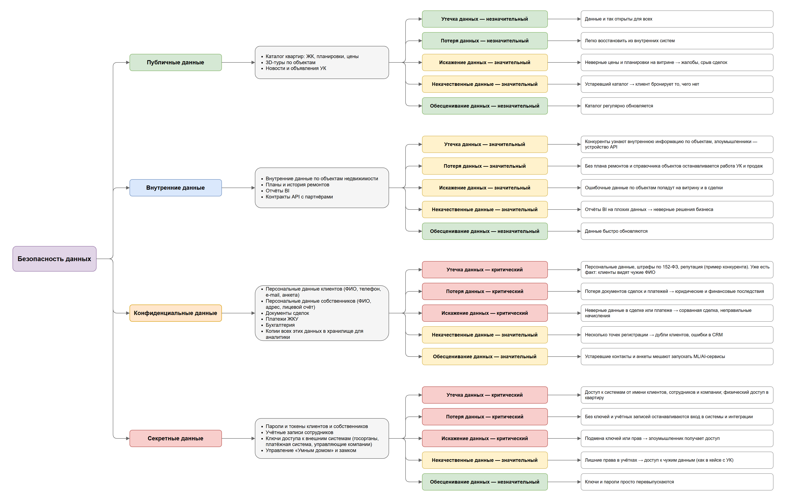

# Задание 1. Mindmap «Безопасность данных»

- `data-security-mindmap.drawio` — исходник (draw.io)
- `data-security-mindmap.png` — превью

Структура: **Безопасность данных → категория данных → какие данные относятся → риск и его оценка → почему так оценили.**

Оценка риска: зелёный — незначительный, жёлтый — значительный, красный — критический.

