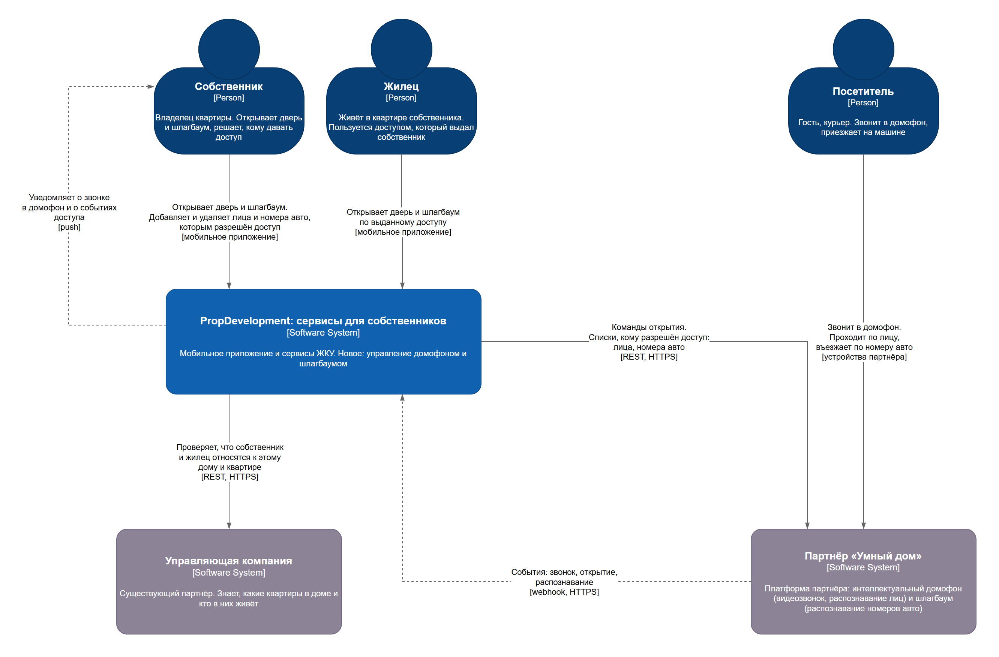
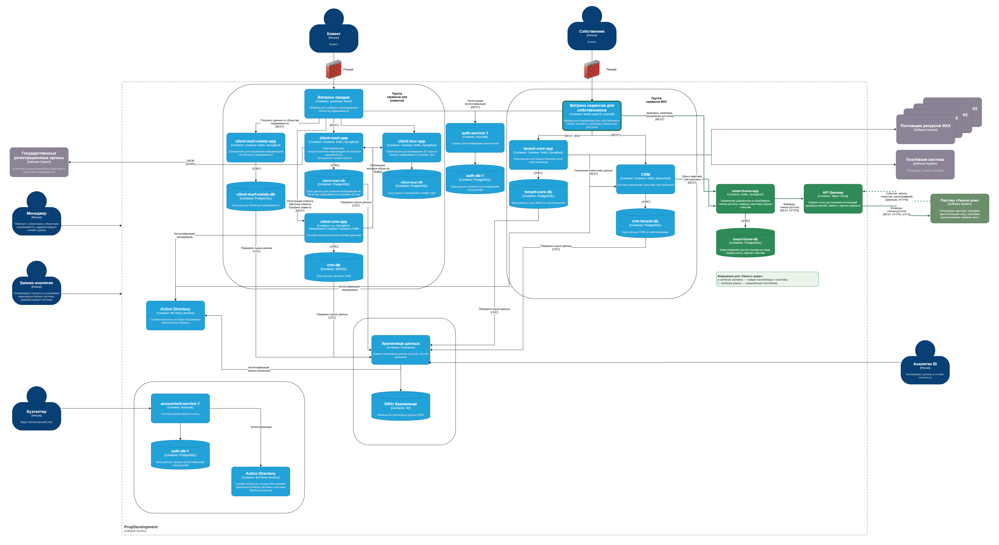

# Задание 3. Внешние интеграции — сервисы «Умный дом»

- `context-diagram.drawio` / `context-diagram.png` — диаграмма контекста
- `container-diagram.drawio` / `container-diagram.png` — обновлённая диаграмма контейнеров (новое выделено зелёным)
- `integration-requirements.md` — требования к внешним интеграциям: безопасность, аутентификация и авторизация, взаимодействие

## Диаграмма контекста

## Диаграмма контейнеров

Исходная диаграмма из кейса с изменениями. Зелёная заливка — новые контейнеры и системы, зелёная рамка — изменённый контейнер.

